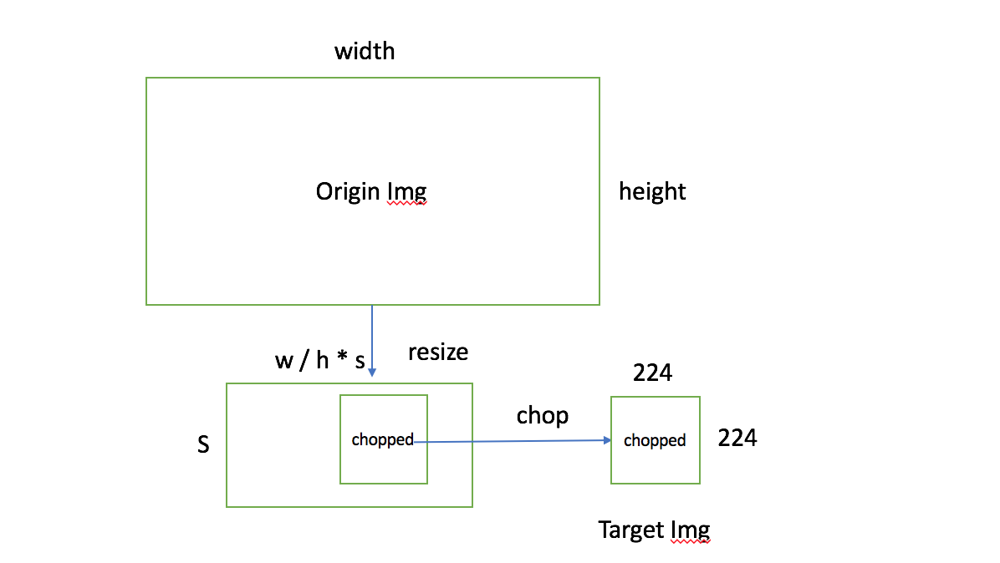
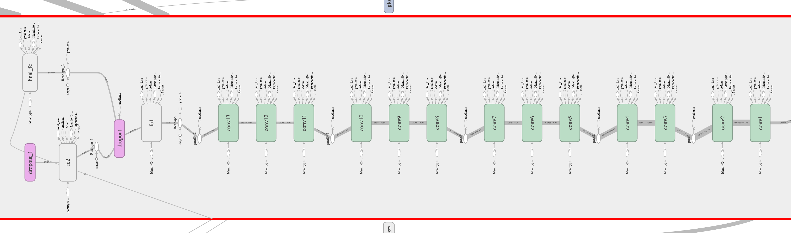

# VGG Reading Report

>组员：
>林诗鹭 (14353184)
>赵明宇 (14331382)

## Table of Contents

[TOC]

## 一、VGG论文理解

### 1.1 概述

VGG主要探究了随着卷积神经网络层数的增加，模型的所发生的变化。

主要得到的结论有以下几点：

1. 堆叠排放(stack)而相对小receptive区域的卷积层比单层大receptive区域的效果好。能更有效地提取特征同时减少参数总量。
2. 合适的初始化有利于模型，特别是深度网络的训练。

### 1.2 VGG网络结构

VGG模型使用更深的网络以获取更好的性能，所有激活函数使用ReLU，网络结构主要包括以下几个方面：

#### 1.2.1 卷积层 (Conv)

- 卷积步长为1
- 使用堆叠的3×3的滤波器，而不是5x5滤波器
- 有的配置中1×1的滤波器，通过激活函数可以提供非线性

#### 1.2.2 池化层 (Pooling)

- 使用Max-pooling


- 共有5层
- 2×2窗口，步长为2

#### 1.2.3 全连接层 (Fully-Connected)

- 前2层每个有4096通道
- 最后1层有1000通道

#### 1.2.4 Drop Out层

- 两个全连接层后面会接上Drop Out，作用是训练时会随机丢弃一些节点

### 1.3 实现细节

#### 1.3.1 图像预处理

- 模型接受的图像大小为224×224，因此需要对输入的原图进行裁切，具体操作为
  - resize最小边到给定的参数S
  - 随机裁切出一块224×224的图片（如图所示）



- 随机翻转图片：包括水平和上下翻转，目的是增强训练集的多样性，避免过拟合
- 随机进行RGB-Shift，理由同上
- 在整个训练集上计算均值并为每个像素减去RGB均值

#### 1.3.2 训练

- 图片大小：裁剪成224×224的大小
- Network weight初始化：用预先训练好Network A的参数来初始化其他网络的前4个卷积层和后3个全连接层

#### 1.3.3 测试

- 第1个全连接层转化为7×7的卷积层,最后2个全连接层转化为1×1的卷积层

#### 1.3.4 评估

- 用top1-error和top5-error对模型进行评估
  - Singal Scale Evalution: 经过验证表明，更深次的网络、更小的filter效果较好
  - Multi-Scale Evalution:
  - Multi-Crop Evalution:
  - Convent Fushion:


## 二、VGG网络分析与实现

我们在本次试验中实现的是论文中给出的D网络，具体配置为：

- 13 卷积层 + 3 全连接层
- 卷积层：64 * 2, 128 * 2, 256 * 3, 512 * 3, 512 * 3
- 参数数量：138 million

搭建VGG网络部分Code（更细节的部分已经加以封装，可以查看[源码](https://github.com/alex-myzhao/vgg)）：

```python
conv1 = self.conv_layer(input_, 3, 64, 'conv1', is_BN, is_train)
conv2 = self.conv_layer(conv1, 3, 64, 'conv2', is_BN, is_train)
pool1 = tf.nn.max_pool(conv2, ksize=[1, 3, 3, 1],
                       strides=[1, 2, 2, 1],
                       padding="SAME", name="pool1")

conv3 = self.conv_layer(pool1, 3, 128, 'conv3', is_BN, is_train)
conv4 = self.conv_layer(conv3, 3, 128, 'conv4', is_BN, is_train)
pool2 = tf.nn.max_pool(conv4, ksize=[1, 3, 3, 1],
                       strides=[1, 2, 2, 1],
                       padding="SAME", name="pool2")

conv5 = self.conv_layer(pool2, 3, 256, 'conv5', is_BN, is_train)
conv6 = self.conv_layer(conv5, 3, 256, 'conv6', is_BN, is_train)
conv7 = self.conv_layer(conv6, 3, 256, 'conv7', is_BN, is_train)
pool3 = tf.nn.max_pool(conv7, ksize=[1, 3, 3, 1],
                       strides=[1, 2, 2, 1],
                       padding="SAME", name="pool3")

conv8 = self.conv_layer(pool3, 3, 512, 'conv8', is_BN, is_train)
conv9 = self.conv_layer(conv8, 3, 512, 'conv9', is_BN, is_train)
conv10 = self.conv_layer(conv9, 3, 512, 'conv10', is_BN, is_train)
pool4 = tf.nn.max_pool(conv10, ksize=[1, 3, 3, 1],
                       strides=[1, 2, 2, 1],
                       padding="SAME", name="pool3")

conv11 = self.conv_layer(pool4, 3, 512, 'conv11', is_BN, is_train)
conv12 = self.conv_layer(conv11, 3, 512, 'conv12', is_BN, is_train)
conv13 = self.conv_layer(conv12, 3, 512, 'conv13', is_BN, is_train)
pool5 = tf.nn.max_pool(conv13, ksize=[1, 3, 3, 1],
                       strides=[1, 2, 2, 1],
                       padding="SAME", name="pool3")

fc1 = self.fc_layer(pool5, 4096, 'fc1', is_BN, is_train)
if is_train:
    fc1 = tf.nn.dropout(fc1, 0.5)
fc2 = self.fc_layer(fc1, 4096, 'fc2', is_BN, is_train)
if is_train:
    fc2 = tf.nn.dropout(fc2, 0.5)
final_fc = self.final_fc_layer(fc2, self.class_num,
                               'final_fc', is_train)
return final_fc
```

TensorBoard:




## 三、训练细节

本实验用VGG处理的是一个20分类的图像识别问题：输入一张图像，预测其中包含的类别

20个分类包含:

```python
[
    'aeroplane', 'bicycle', 'bird', 'boat',
    'bottle', 'bus', 'car', 'cat',
    'chair', 'cow', 'diningtable', 'dog',
    'horse', 'motorbike', 'person', 'pottedplant',
    'sheep', 'sofa', 'train', 'tvmonitor'
]
```

- 使用数据：
  - 训练集：VOC 2012 Test
  - 测试集：VOC 2012 Validation
- Batch size: 32
- Learning rate
- Iteration
- Loss曲线


## 四、评估

- 本实验中使用到的方法：
  - 定量：为每一类别计算AverP，并最终计算mean AverP
  - 定性：观察对输入图片的分类情况
